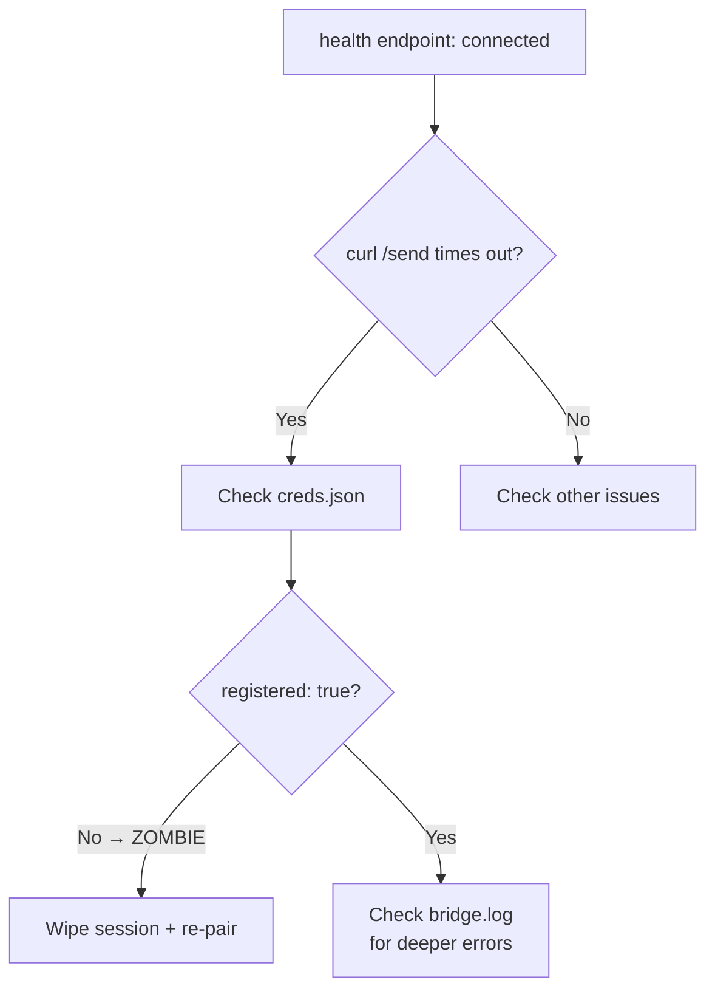

# WhatsApp Bridge — Architecture & Troubleshooting

## How the Bridge Works

The WhatsApp bridge runs as a WhatsApp Web client (via `@whiskeysockets/baileys`) paired with **H's own phone number** (`+233***2252`). It is *not* a separate bot number — it uses H's existing WhatsApp account via Web pairing.

```
WhatsApp Bridge ── WhatsApp Web paired with H's number ── [H's WhatsApp]
     │                                                      │
     │ sends outbound messages AS H                        │ other people message H
     │                                                     │ (John, Sammy, etc.)
     ▼                                                     ▼
  Contacts receive "H" messages                      Bridge reads inbound
```

## Outbound (Sending)

Sends WhatsApp messages as H to any contact. The `send_message` tool routes through the Hermes gateway → WhatsApp bridge (`POST /send`) → WhatsApp Web → recipient.

**Depends on session state.** The bridge may report "connected" via the health endpoint while the underlying Baileys WebSocket is actually in a degraded state where `sock.sendMessage()` hangs indefinitely. See the Diagnostics section for how to distinguish real connectivity from a zombie session.

Targets must be on the Hermes-level allowlist (`config.yaml → whatsapp.allow_from`) AND have an active WhatsApp chat session with H's number.

## Inbound (Receiving Instructions)

**Messages FROM the paired number itself are filtered at the bridge level.** The bridge log shows:

```
🔒 Allowed users: hermeswhatsapp
...
{"event":"ignored","reason":"allowlist_mismatch","chatId":"233204252252@s.whatsapp.net","senderId":"233204252252@s.whatsapp.net"}
```

The bridge only processes messages it can attribute to a *different* WhatsApp account/user — it skips messages from the paired phone's own number. This means **you cannot give instructions by messaging yourself on WhatsApp**. The inbound channel works for messages from *other* people (John, Sammy, etc. messaging H's number), not self-messages.

**Telegram DM is the primary input channel.** WhatsApp is best for outbound messaging and receiving inbound messages from contacts.

## Two Allowlist Layers

### 1. Bridge-Level (baileys session)
The bridge script has its own concept of "allowed users" — effectively the paired session identity. Self-messages from the paired number are dropped here before Hermes sees them.

To change this behavior, you'd need to modify the bridge script at:
`$HERMES_HOME/scripts/whatsapp-bridge/`

### 2. Hermes-Level (`config.yaml`)
```yaml
whatsapp:
  dm_policy: allowlist
  allow_from:
    - "+233***2252"   # H's own number (on the list but self-filtered at bridge level)
    - "+233***2253"   # Sammy
    # ... 60+ contacts
  group_policy: allowlist
  group_allow_from:
    - "+233***5796"
```

This controls which numbers the *Hermes agent* will process. But messages must first get past the bridge layer.

## Diagnosing WhatsApp Bridge Issues

### Check bridge status
```bash
cat ~/.hermes/whatsapp/bridge.log | tail -30
```

### Key log signals (`~/.hermes/whatsapp/bridge.log`)

| Signal | Meaning |
|--------|---------|
| `✅ WhatsApp connected!` | Bridge session active — but may still be a **zombie session** (see below) |
| `⚠️ Connection closed (reason: 428)` | Session expired — auto-reconnects with same stale creds |
| `⚠️ Connection closed (reason: 408)` | Connection timed out — auto-reconnects |
| `"reason":"allowlist_mismatch"` + `"chatId":"233204252252@..."` | Self-message filtered (expected) |
| `"reason":"allowlist_mismatch"` + other chatId | Someone not on allowlist messaged (expected) |
| `"timed out waiting for message"` | USync fetch timeout (harmless) |
| `"Timeout in AwaitingInitialSync, forcing state to Online"` | **Critical.** Bridge timed out during initial data sync but forced itself to "Online". Happens when `registered: false` in creds — the WhatsApp number was never fully registered. This is the #1 cause of zombie sessions. |
| `"No session found to decrypt message"` | Baileys signal sessions never properly established. Follow-on symptom of incomplete registration. |
| `"transaction failed, rolling back"` | Credential sync keeps failing. Another sign of a zombie session. |

### Zombie session detection flow

The most common WhatsApp bridge failure is a **zombie session** — health reports "connected" but `sock.sendMessage()` hangs. Here's the proven diagnostic chain:



**Step-by-step:**

1. **Check gateway state** — `cat ~/.hermes/gateway_state.json` — look for `"whatsapp":{"state":"connected"}`. A green state here means the Python gateway adapter can reach the bridge HTTP server, NOT that the Baileys socket can send messages.

2. **Check bridge health** — `curl -s http://127.0.0.1:3000/health` — if `"status":"connected"` but you suspect issues, proceed.

3. **Test the send endpoint** — `curl -sv --connect-timeout 5 --max-time 30 -X POST http://127.0.0.1:3000/send -H "Content-Type: application/json" -d '{"chatId":"233xxxxxxxxx@s.whatsapp.net","message":"test"}'` — if it hangs (no response in 30s), the sock.sendMessage() call is blocking. This is the definitive test.

4. **Check creds.json** — `cat ~/.hermes/whatsapp/session/creds.json | grep registered` — if `"registered": false`, the WhatsApp number was never fully registered. This is the root cause.

5. **Check bridge.log for AwaitingInitialSync** — `grep "AwaitingInitialSync" ~/.hermes/whatsapp/bridge.log` — if present, confirms the bridge forced itself Online before sync completed.

6. **Check bridge process** — `wmic process where "name='node.exe'" get ProcessId,CommandLine` or `ps aux | grep bridge` — verify the bridge is running with expected `--mode` flag.

### Fixing a zombie session

```bash
# 1. Stop the gateway
hermes gateway stop

# 2. Wipe the stale session
rm -rf ~/.hermes/whatsapp/session/

# 3. Restart gateway — bridge generates a fresh QR code
hermes gateway restart

# 4. Check bridge.log for QR output
tail -f ~/.hermes/whatsapp/bridge.log | grep -A5 QR
# Look for: "📱 Scan this QR code with WhatsApp on your phone:"

# 5. Open WhatsApp → Linked Devices → Link a Device → scan the QR
```

### Bridge mode detection

The `--mode` flag determines inbound filtering behavior:
- **`--mode bot`** (Business mode) — rejects ALL self-messages from the paired number. Inbound only works for other numbers. Used when the bridge is a separate business profile.
- **`--mode self-chat`** — processes messages the user sends to themselves. Used when the bridge is paired with the user's personal WhatsApp.
- **`--mode bot`** with no `WHATSAPP_ALLOWED_USERS` env → all inbound messages rejected; only outbound works.

Detect: `wmic process where "name='node.exe'" get CommandLine | grep bridge` and look for `--mode`.

### "Waiting for scan..." — Bridge needs QR re-pair

**Symptom:** Bridge log ends with:
```
Waiting for scan...
```
No `✅ WhatsApp connected!` appears after this line. The bridge process is running but stuck at QR code generation, waiting for a scan that never comes.

**Root cause:** The Baileys session was fully invalidated (server-side logout, session expiry, or creds wipe). The bridge generated a QR code but nobody scanned it, and the bridge stays waiting. Unlike the zombie-session pattern (where it falsely reports connected), this state is honest — it's genuinely waiting.

**How it differs from other states:**

| State | Log signal | Bridge process | Sends messages? |
|-------|-----------|----------------|-----------------|
| Connected | `✅ WhatsApp connected!` | Running | Yes (if not zombie) |
| Zombie | `✅ WhatsApp connected!` + `AwaitingInitialSync` in creds | Running but degraded | No (send hangs) |
| Reconnecting | `⚠️ Connection closed (reason: 428/408)` → `✅ WhatsApp connected!` | Restarting loop | Briefly, then fails |
| **Waiting for scan** | `Waiting for scan...` (final line) | Running, no session | **No** |

**Diagnosis:**
```bash
# Check if bridge process is running
cat ~/.hermes/whatsapp/session/bridge.pid 2>/dev/null || echo "No PID file"

# Check last lines of bridge.log
tail -20 ~/.hermes/whatsapp/bridge.log

# Check if gateway_state shows whatsapp
cat ~/.hermes/gateway_state.json | python3 -c "import json,sys; d=json.load(sys.stdin); print(d.get('whatsapp',{}))"
```

**Fix — Full re-pair:**
```bash
# 1. Stop the gateway
hermes gateway stop

# 2. Wipe the stale session (if no usable creds exist)
rm -rf ~/.hermes/whatsapp/session/

# 3. Restart gateway — bridge generates a fresh QR code
hermes gateway restart

# 4. Watch for QR output in bridge.log
tail -f ~/.hermes/whatsapp/bridge.log

# 5. On phone: WhatsApp → Linked Devices → Link a Device → scan the QR
# 6. Verify: log should show "✅ WhatsApp connected!" after scan
```

**If the bridge process is NOT running** (no PID file, no process):
```bash
# Start gateway directly
hermes gateway run
# or as service
hermes gateway start
```

## Config Reference

```yaml
whatsapp:
  dm_policy: allowlist          # Only allowlisted numbers can DM
  allow_from:                   # List of allowed numbers
    - "+233***..."
  group_policy: allowlist       # Same for groups
  group_allow_from:             # Allowed group participants
    - "+233***..."
```

## Session Data Location

- Bridge logs: `~/.hermes/whatsapp/bridge.log`
- Session creds: `~/.hermes/whatsapp/session/creds.json`
- Channel directory: `~/.hermes/channel_directory.json`
- Gateway state: `~/.hermes/gateway_state.json`